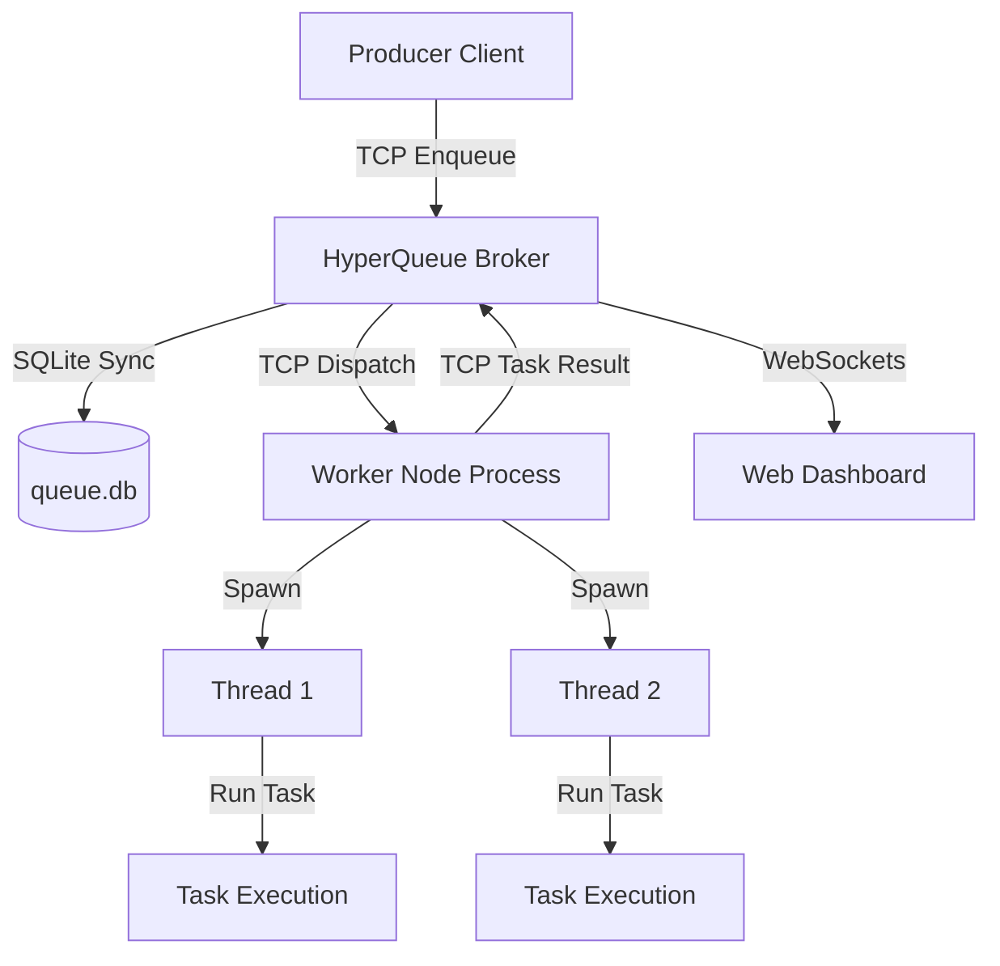

# HyperQueue: Distributed Task Queue

HyperQueue is a lightweight, high-performance distributed task queue built entirely from scratch in Node.js. It features a centralized TCP-based Broker, multi-threaded worker nodes, persistent SQLite logging (`node:sqlite`), and a sleek real-time monitoring dashboard via WebSockets.

Designed as a mini Celery/BullMQ clone, this project showcases deep systems programming concepts including **TCP sockets**, **multithreading with worker threads**, **database state transactions**, **exponential backoff retry schedules**, and **real-time event systems**.

---

## Key Features

- ⚡ **TCP Socket Protocol:** Structured communication between Broker, Workers, and Producers using newline-delimited JSON (NDJSON) over raw TCP sockets.
- 🧵 **Multi-threaded Workers:** Worker nodes handle tasks inside a thread pool utilizing Node's native `worker_threads`, preventing blocking operations from stalling network heartbeats.
- 💾 **SQLite State Persistence:** Utilizes Node.js v22.5.0+'s built-in `node:sqlite` engine to maintain transactional state. Tasks are never lost, even if the Broker restarts.
- 🕒 **Task Scheduling:** Support for delayed job execution. Scheduled jobs remain persistent and are released immediately upon maturity.
- 🔄 **Retry Engine & Backoff:** Automatic task retry handling on failure. Uses an exponential backoff schedule: $Backoff = 2\text{s} \times 2^{\text{attempt}}$.
- 📊 **Real-time Concurrency Dashboard:** A glassmorphic monitoring dashboard serving stats, connected worker nodes, CPU workloads, and registry history.

---

## Architecture Diagram



---

## File Structure

```bash
distributed-task-queue/
├── broker.js                 # Central TCP broker, SQLite transaction manager, and dashboard server
├── worker.js                 # TCP Worker Client managing process connections and heartbeats
├── worker_thread_runner.js   # Script executing inside worker threads to run dynamic tasks
├── client.js                 # Producer Client API to submit tasks from external scripts
├── queue.db                  # SQLite database generated at runtime
├── tasks/                    # Task implementations
│   ├── heavy_computation.js  # CPU-heavy prime-number solver
│   └── flaky_task.js         # Simulation of unstable network API calls
└── dashboard/                # Real-time Web monitoring panel
    ├── index.html            # Dashboard structure
    ├── style.css             # Glassmorphic layout and visual theme
    └── app.js                # WebSocket UI controller
```

---

## How to Run Locally

### 1. Start the Broker
The broker manages client connections, worker assignments, database states, and hosts the dashboard:
```bash
npm run broker
# OR
node broker.js
```
*The TCP broker will run on port `4000`, and the Web Dashboard will be available at [http://localhost:3050](http://localhost:3050).*

### 2. Start One or More Workers
Workers connect to the broker and register their concurrency level (default is `2` threads). You can spin up multiple worker processes in separate terminals:
```bash
npm run worker
# OR
node worker.js
```

### 3. Enqueue Tasks (Producer Client)
You can run the built-in producer script to submit a batch of mixed tasks (heavy CPU, flaky, and scheduled):
```bash
npm run client
# OR
node client.js
```
Alternatively, open the Dashboard at [http://localhost:3050](http://localhost:3050) and use the **Task Generator** buttons to trigger tasks and inspect execution live.
